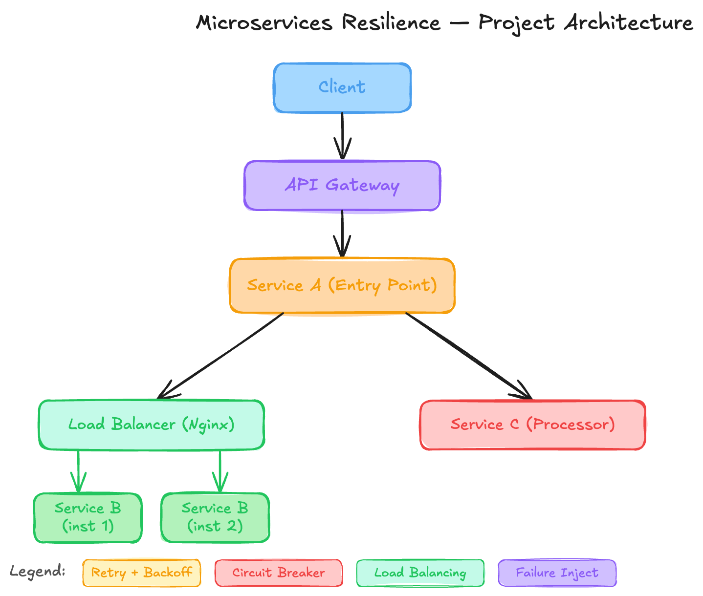
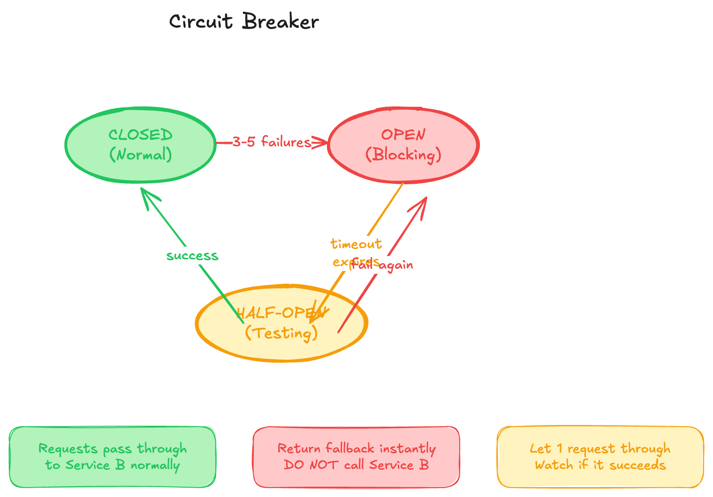

# Fault-Tolerant Distributed System

A small microservices demo showing retries, load balancing, and reverse proxy routing with FastAPI, Docker Compose, and NGINX.

## Architecture



## Circuit Breaker / Resilience Flow



## Services

- Service A (`8000`): Aggregates data from Service B and Service C.
- Service B (`8001`, replica on `8003`): Responds to `/data` and is load-balanced by NGINX.
- Service C (`8002`): Responds to `/data`.
- NGINX (`80`): Reverse proxy for internal service-to-service calls.

## Run

```bash
docker compose up --build
```

## Try It

- Main API (aggregated response):

```bash
curl http://localhost:8000/data
```

- Through NGINX routes:

```bash
curl http://localhost/service-b/data
curl http://localhost/service-c/data
```

## Fault-Tolerance Features

- Retry with exponential backoff in Service A for upstream calls.
- Retryable handling for transient failures.
- NGINX upstream pool for Service B replicas.

## Stop

```bash
docker compose down
```
